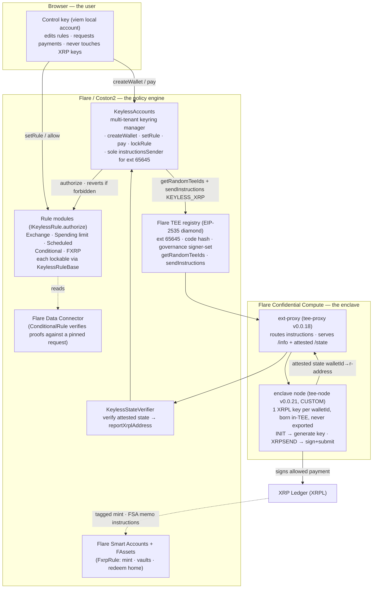
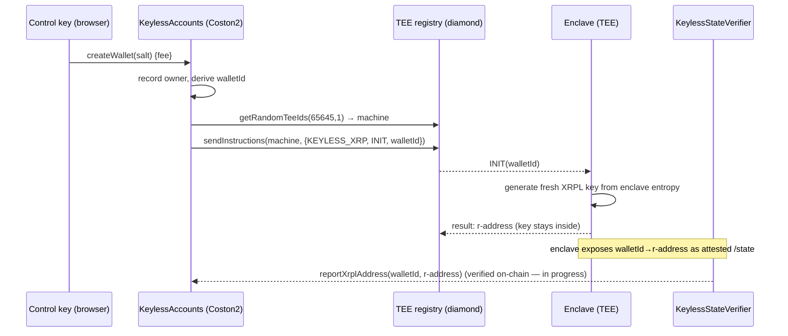
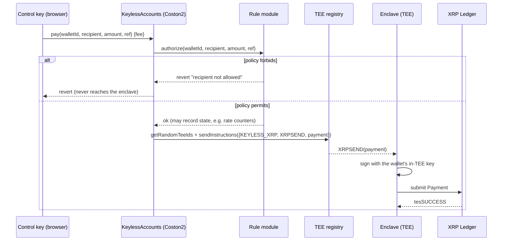

# Architecture

## One-sentence model

> An XRPL signing key is **generated inside a Flare Confidential Compute TEE and never leaves it**, and it will only sign a payment that an **on-chain policy contract on Flare** has already approved — so the account can only ever pay what the rules permit, and no one can extract the key.

> **Note:** an earlier design made Keyless a policy layer on Flare's Protocol Managed Wallets (PMW). That path is dead — binding a contract as a PMW authorization address requires Flare's governance-gated system extension. Keyless now runs **its own permissionless FCC extension** and custodies the key in-enclave. The rest of this doc describes the live design.

---

## Components

**Layer responsibilities**
- **Coston2** decides *what may be signed* (policy) and *who may command the enclave* (the registry pins the code hash + governance + instructionsSender).
- **FCC enclave** *does the signing* — one XRPL key per wallet, generated from enclave entropy, never exported. Only the address ever leaves.
- **XRPL** *settles*. Two more Flare surfaces hang off it: the **Data Connector**, which `ConditionalRule`
  uses to turn a real-world fact into on-chain truth, and **FAssets + Smart Accounts**, which `FxrpRule` uses
  to move XRP to Flare, earn, and bring it home.

---

## Flow 1 — `createWallet` (a key is born in the TEE)

## Flow 2 — `pay` (policy gates every signature)

The critical property: the rule check happens **on-chain, before** the instruction is dispatched. A payment the policy rejects is never sent to the enclave, and the enclave has no key-export path — so neither a stolen control key nor a compromised app can move funds outside the rules.

---

## Threat model

| Adversary holds… | Can they drain the account? |
| --- | --- |
| The browser **control key** | No (if the rule is **locked**). They can only call `pay` to policy-approved recipients; `lockRule` freezes the rule pointer + config so they can't repoint to a permissive rule. On an **unlocked** account a stolen control key *can* `setRule`→`pay`, so lock before funding. |
| The **app / frontend** | No. It can only ask for payments; the rule and the enclave gate them. |
| The **machine operator** (runs the enclave) | No. The key is generated in-TEE and never exported; the enclave only obeys `getTeeExtensionInstructionsSender(65645)` = KeylessAccounts. |
| Someone who **swaps the enclave image** | No. A machine only joins ext 65645 by attesting to the registered code hash under the registered governance. A different image ≠ the registered hash. |
| A **quantum** attacker | Out of scope. They'd derive the key from its public key and sign on XRPL directly, bypassing Flare. Keyless enforces policy, not post-quantum key secrecy. |

---

## Contracts (`backend/src`)

- **`KeylessAccounts.sol`** — the multi-tenant keyring manager and the extension's sole `instructionsSender`. `createWallet` (sends INIT), `setRule`, `pay` (runs the rule then sends XRPSEND), `lockRule`, `xrplAddressOf`. Discovers its extension id via `setExtensionId()` (loops `FIRST_PUBLIC_EXTENSION_ID … nextPublicExtensionId()`).
- **`rules/KeylessRuleBase.sol`** — shared scaffolding: `onlyAccounts`, lockable config (`isLocked`).
- **`rules/ExchangeRule.sol`** — approved recipients, each optionally pinned to an exact XRPL destination
  tag (the tag rides in the top 4 bytes of `paymentReference`), plus an optional per-payment cap. Pinning
  `(recipient, tag)` as a pair means a stolen control key can't send to the same exchange under someone
  else's tag.
- **`rules/RateLimitRule.sol`** — approved recipients + a cap per rolling window, calendar period, or
  one-off budget. The window rolls **lazily**, inside `authorize`.
- **`rules/ScheduledRule.sol`** — fixed payee, fixed amount, fixed calendar slot, capped number of runs.
  Missed runs are skipped, never accrued, so an idle account can't wake up owing a backlog.
- **`rules/ConditionalRule.sol`** — pays only once Flare's Data Connector attests a fact. Pins the **whole**
  Web2Json request (url, query, jq, ABI signature), so a proof of a different API returning the same value
  can't release it. Refuses every recipient — payee *and* fallback — until proven.
- **`rules/FxrpRule.sol`** — mint XRP→FXRP into a Smart Account **computed on-chain from the walletId**,
  a closed allowlist of vault instruction ids, redeem home, and cash out only to approved payees.
- Superseded and kept deployed so older accounts keep working: `AllowlistRule`, `SubscriptionRule`,
  `FxrpMintRule`, `FxrpDefiRule`.
- **`KeylessStateVerifier.sol`** — receives the enclave's attested INIT state and writes `xrplAddressOf` **only if the TEE attested to it** (in progress; replaces a trusted relayer).

## The enclave (`enclave/`)

Forked from Flare's `fce-sign`, but the node logic (`go/internal/extension`) is **custom** and is the security core: it generates one XRPL key per `walletId` inside the enclave (`processInit`) and has **no code path to import or export a key** — the opposite of `fce-sign`, which imports an operator-supplied key. Only the XRPL address is exposed, via the attested `GET /state`. Registration tooling lives in `go/tools` (`register-extension`, `finish-setup`, `set-governance`, `register-tee`); the proxy is built self-contained from tee-proxy v0.0.18.

## FCC registration model (what makes the TEE trustworthy)

1. **Register the extension** (permissionless) → assigns a public id ≥ `0x10000` (ours: **65645**), with KeylessAccounts as `instructionsSender`.
2. **`addTeeVersion`** → pin the enclave image's `codeHash` (+ platform) for the extension.
3. **`set-governance`** → register the `(signers, threshold)` the enclave signs its machine data with.
4. **`register-tee`** → the machine attests, passes the FTDC availability check, and is promoted to production. Now `getRandomTeeIds(65645)` returns it and KeylessAccounts can command it.

See [`FCC_TRACK2.md`](FCC_TRACK2.md) for why this is genuinely confidential compute (verified on-chain, not asserted), and [`DEPLOY_RUNBOOK.md`](DEPLOY_RUNBOOK.md) for the go-live sequence.
