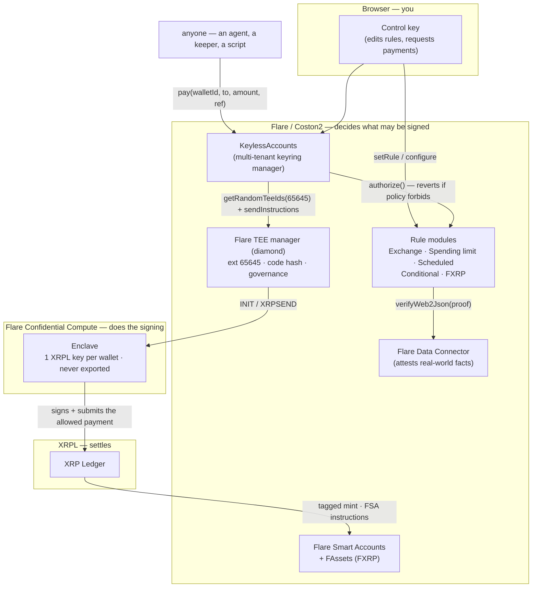

# Keyless

**An XRP account that only does what you allow — and can't be drained, even by whoever runs it.**

Keyless gives an XRP wallet a signing key that is **born inside a Flare Confidential Compute TEE and never
leaves it**. That key will only ever sign a payment an **on-chain policy on Flare** has already approved.
Steal the browser control key, compromise the app, or own the machine the enclave runs on — none of it lets
you move funds anywhere the rules forbid. There is no exportable key to take.

> The rules aren't for you. They're for whoever gets in.

**[Try it — no wallet, no signup →](https://keyless-testnet.vercel.app)** · **[Demo video →](https://youtu.be/kqzGtkM0gB8)**

---

## Live on Coston2 right now

Read from `KeylessAccounts` events on 2026-08-13 — every number below is on-chain, not self-reported.

| | |
|---|---|
| Accounts created | **77**, across **26** distinct owners |
| XRPL keys generated **inside the enclave** | **70** |
| Accounts with a policy attached | **71** |
| Payments a contract had to approve first | **72**, across 29 accounts |
| **XRP moved under policy** | **2,882.5** |
| Policies locked forever (irreversible) | **3** |
| Contract tests | **78 passing** (`forge test`) |

---

## The problem

Holding XRP is all-or-nothing. Whoever has the private key can send **anything, anywhere** — so:

- **A stolen key is a drained account.** Phishing, malware, a leaked backup: one compromise is total loss.
  There is no "this key may only pay my exchange" setting on a raw wallet.
- **Bots, agents and services must hold live keys.** An automated strategy or an AI agent needs to sign on
  its own, which means a hot key that empties the account if it leaks. That risk is why few people run them.
- **Teams face the same choice.** Either one person holds the key, or you bolt on multisig ops. Neither
  expresses a rule as simple as "only pay approved addresses, max 10 XRP a day."
- **XRPL can't fix this itself.** The XRP Ledger has **no smart contracts** — there is nowhere *on XRP* to
  enforce a spending policy. Historically the only options were "trust the key holder" or "trust the
  operator's server", and a server that can promise rules can also be changed.

The missing primitive: a key that is **provably unextractable** and **provably obedient to a public rule**.

## The solution

Keyless puts the policy on **Flare** and binds an XRPL signing key to it inside a **Confidential Compute
TEE**:

- The signing key is **generated inside the enclave and never leaves** — nobody, including us or the machine
  operator, has ever seen it.
- Every payment must pass an **on-chain policy contract** on Flare before the enclave will sign it.
- Anyone can **verify the binding on-chain**: which contract commands the enclave, and which exact code hash
  the enclave runs.

The trust boundary moves from "trust the key holder" to **"read the contract and read the registered code
hash."** XRPL settles; Flare decides whether it's allowed; the TEE holds a key that can't be stolen and
won't disobey.

---

## How it works — the trust chain

Every link is verifiable on-chain or in open source.

1. **The key is born in the enclave.** `createWallet` sends an `INIT` instruction, and the enclave answers by
   **generating a fresh XRPL key from its own entropy**. No key is ever imported, and only the resulting
   *address* leaves. (Flare's reference `fce-sign` does the opposite — it imports an operator-supplied key.
   We deliberately have no such code path.)
2. **The code hash is pinned on-chain.** The Keyless FCC extension (**id 65645** on Coston2) registers the
   enclave image's code hash and a governance signer-set. A machine can only join by attesting to *that
   exact hash* under *that governance* — so "trust the operator" becomes "read the registered code hash."
3. **One contract is the only boss.** `KeylessAccounts` is the extension's sole `instructionsSender`
   (`isBound = true`). The enclave acts on instructions from that contract and nothing else.
4. **A policy gates every signature.** `pay()` runs the wallet's rule *before* the instruction is sent. If
   the rule reverts, the enclave never sees the payment.

### The enclave has exactly two operations

| Op | What it does |
|---|---|
| `INIT` | Generate a new XRPL keypair inside the enclave; return **only** the address |
| `XRPSEND` | **Construct** and sign one XRPL `Payment` from `(recipient, amount, paymentReference)` |

`XRPSEND` never signs a transaction it is handed — it **builds** one from fields the contract already
approved. That's what makes "it can't sign outside the rules" a fact rather than a promise, and it's why
adding a policy never touches the enclave.

### `pay()` is permissionless — on purpose

```solidity
function pay(bytes32 walletId, string calldata recipient, uint256 amount, bytes32 paymentReference)
    external payable
{
    address rule = ruleOf[walletId];
    if (rule == address(0)) revert NoRule();
    IKeylessRule(rule).authorize(walletId, recipient, amount, paymentReference); // reverts if forbidden
    instructionId = _send(OP_PAY, abi.encode(XrplPayment(walletId, recipient, amount, paymentReference)));
}
```

There is no `msg.sender` check. **The rule is the gate, not the caller** — which is why you can hand an
agent an account id and nothing else, and why a keeper can trigger a scheduled or proven payment without
being trusted.

That is only safe because of an invariant every rule must hold: **a rule must pin where the money can go,
because nothing pins who can ask.** (One configuration once broke it; see
[`SECURITY_NOTES.md`](SECURITY_NOTES.md) #0.)

### The payment reference

32 bytes. The **top 4 are the XRPL destination tag**, big-endian; the rest is a memo. The enclave sets the
ledger's `DestinationTag` from those bytes, and `ExchangeRule` compares them against the tag pinned to the
recipient — so a CEX deposit is bound to *(address, tag)* as a pair. Sending to the right exchange under
someone else's tag is refused.

For FXRP the same field carries a Flare Smart Account instruction id in byte 0.

---

## Architecture



**Four Flare systems, all load-bearing:** Confidential Compute holds the key, the Data Connector turns
real-world facts into on-chain truth, FAssets moves XRP to Flare as FXRP, and Smart Accounts run the vault
operations. XRPL settles.

---

## The five policies

Each policy is one small Solidity contract. **The enclave never changes when a policy is added.**

| Policy | What it enforces | For |
|---|---|---|
| **Exchange & allowlist** | Pay only approved addresses, each optionally pinned to an exact destination tag, plus a per-payment cap | Exchange-only and cold-storage accounts |
| **Spending limit** | An approved list **+** a cap per rolling window, calendar period, or one-off budget | Agents, apps, allowances |
| **Scheduled payments** | Fixed payee, fixed amount, fixed calendar slot, capped number of runs. Missed runs are skipped, never accrued | Payroll, standing orders, DCA |
| **Conditional** | Pay only once Flare's Data Connector attests a real-world fact. Refuses **every** recipient — payee and fallback — until proven | Escrow, bounties, parametric insurance |
| **FXRP** | Mint XRP → FXRP into an account-derived Smart Account, run whitelisted vault operations, redeem home, cash out to approved payees | Yield on idle XRP |

Policies are **lockable**: `lockRule(walletId)` one-way freezes the rule pointer *and* its configuration, so
a later-stolen control key can't widen it.

---

## The flows

### Creating an account
`createWallet(salt)` → `INIT` → the enclave generates an XRPL keypair from its own entropy → reports back
only the address → `xrplAddressOf(walletId)`. **The policy is chosen before `INIT` fires**, so no account
has ever existed without a rule.

### Making a payment
`pay()` → the rule's `authorize()` runs on-chain → if it reverts, the enclave is never asked → otherwise
`XRPSEND` → the enclave builds a `Payment`, signs it, submits it to XRPL.

### A conditional payout
`configure()` pins the **whole** Web2Json request — url, query params, jq transform and ABI signature — into
the rule. A watcher (anyone can run it) reads the API, requests an attestation, waits for the voting round,
and calls `release(proof)`. `ConditionalRule` verifies the proof against the **pinned request**, so a proof
of a *different* API returning the same value cannot release it — the vulnerability that killed the earlier
`FdcEscrowRule`.

### The FXRP round trip
A tagged XRPL payment to the FAssets Core Vault mints FXRP into a Smart Account **computed on-chain from the
walletId** — not configurable, so a stolen key can't repoint the mint. Vault operations are a **closed
allowlist** of instruction ids (redeem-home, Firelight, Upshift); everything else reverts, which is why FSA's
later custom instructions (`0xFF`/`0xFE`) were refused with no change required. Cash-out goes only to an
approved payee.

---

## Deployed on Coston2

All verified live on 2026-08-13.

| Component | Address |
|---|---|
| **KeylessAccounts** | [`0x57eb332D…19979`](https://coston2-explorer.flare.network/address/0x57eb332D7000752ee82a35cc1A75941F0a619979) |
| Flare TEE manager (diamond) | [`0x1a9C4A0f…618aE`](https://coston2-explorer.flare.network/address/0x1a9C4A0f9D76c0b1D91d22E24E573a9b377618aE) |
| FCC extension id | **65645** · `isBound = true` |
| Exchange & allowlist | [`0x2E5e2A10…2d7e4`](https://coston2-explorer.flare.network/address/0x2E5e2A1055670b2bc2baBd64f15825e69512d7e4) |
| Spending limit | [`0x51Cc5c71…73710`](https://coston2-explorer.flare.network/address/0x51Cc5c71350d527fDaA188B39f28DE22F4873710) |
| Conditional (FDC) | [`0x2d8517BC…19E77`](https://coston2-explorer.flare.network/address/0x2d8517BC464C70c21bBDBA48d3166a77A5019E77) |
| Scheduled payments | [`0x683bDB59…7Be84`](https://coston2-explorer.flare.network/address/0x683bDB59E9B7Fb43fAfdf9B84A86d794dBf7Be84) |
| FXRP round trip | [`0xAABAEA1D…97482`](https://coston2-explorer.flare.network/address/0xAABAEA1D7887F1681001513030bB57F7f1897482) |
| Flare Smart Accounts (diamond) | [`0x434936d4…AD37c`](https://coston2-explorer.flare.network/address/0x434936d47503353f06750Db1A444DBDC5F0AD37c) |
| AssetManager FXRP | [`0xc1Ca88b9…bDFA`](https://coston2-explorer.flare.network/address/0xc1Ca88b937d0b528842F95d5731ffB586f4fbDFA) |

The attested TEE machine changes when the enclave is redeployed; look up the current one through the
manager diamond rather than trusting a hardcoded address here.

---

## Verify it yourself

Nothing here needs to be taken on trust. Every claim above resolves to a call anyone can make.

```bash
RPC=https://coston2-api.flare.network/ext/C/rpc
KA=0x57eb332D7000752ee82a35cc1A75941F0a619979
DIAMOND=0x1a9C4A0f9D76c0b1D91d22E24E573a9b377618aE

# 1. This contract really is the extension's sole commander.
cast call $KA "extensionId()(uint256)" --rpc-url $RPC          # 65645
cast call $KA "isBound()(bool)"        --rpc-url $RPC          # true
cast call $DIAMOND "getTeeExtensionInstructionsSender(uint256)(address)" 65645 --rpc-url $RPC   # == $KA

# 2. The XRPL address really was reported by the enclave, not written by us.
cast call $KA "xrplAddressOf(bytes32)(string)" <walletId> --rpc-url $RPC

# 3. The rule really does refuse. Read-only, no gas, nothing moves —
#    spoof the caller as KeylessAccounts to pass the rule's onlyAccounts gate.
cast call 0x2E5e2A1055670b2bc2baBd64f15825e69512d7e4 \
  "authorize(bytes32,string,uint256,bytes32)" \
  <walletId> "rSomeAddressNotOnTheList" 1000000 0x00 \
  --from $KA --rpc-url $RPC                                    # reverts: "recipient not allowed"
```

The same refusal is one click in the app — every account page has a **Try to break it** panel that runs
exactly this call against the real deployed rule.

**The traction numbers** in this README come from replaying `KeylessAccounts` events (`WalletCreated`,
`PaymentAuthorized`, `RuleSet`, `RuleLocked`, `XrplAddressReported`) from block 0 via the Coston2 explorer
API — no off-chain database is involved, so anyone can recount them.

**The enclave is in this repo.** `enclave/go/internal/extension` is the security core: `processInit`
generates the key from enclave entropy and there is **no code path that imports or exports a private key**.
The build is reproducible and the image's code hash is what a machine must attest to before it can join
extension 65645 — see [`enclave/REPRODUCIBILITY.md`](enclave/REPRODUCIBILITY.md).

---

## Repository layout

```
keyless/
├── backend/                          Foundry — the policy engine
│   ├── src/
│   │   ├── KeylessAccounts.sol          Keyring manager; the extension's sole instructionsSender
│   │   ├── KeylessStateVerifier.sol     Attested state → xrplAddressOf (skeleton — see Status)
│   │   ├── rules/
│   │   │   ├── KeylessRuleBase.sol         Shared scaffolding (onlyAccounts, lockable)
│   │   │   ├── ExchangeRule.sol            Approved recipients + destination tags + per-tx cap
│   │   │   ├── RateLimitRule.sol           Approved recipients + rolling / calendar / one-off budgets
│   │   │   ├── ScheduledRule.sol           Payee + amount + calendar slot, capped runs
│   │   │   ├── ConditionalRule.sol         Pays only on an FDC-attested fact (pins the whole request)
│   │   │   ├── FxrpRule.sol                Mint → vault → redeem → approved cash-out
│   │   │   └── …                           AllowlistRule, SubscriptionRule, Fxrp{Mint,Defi} (superseded)
│   │   └── lib/, interfaces/
│   ├── test/                         78 tests, incl. the stolen-control-key adversary case
│   └── script/                       Deploy + demo setup for Coston2
├── enclave/                          The Flare Confidential Compute extension
│   ├── go/                              The TEE node — generates keys in-enclave, signs XRPL
│   ├── go/tools/                        register-extension, set-governance, register-tee…
│   ├── proxy/                           Self-contained tee-proxy build
│   └── deploy/executor/                 Watchers: FXRP mints, conditional releases, scheduled runs
├── frontend/                         Next.js + viem — the wallet UI (embedded control key)
└── *.md                              ARCHITECTURE · FCC_TRACK2 · SECURITY_NOTES · POSITIONING · …
```

Deeper docs: [`ARCHITECTURE.md`](ARCHITECTURE.md) (components, sequences, threat model) ·
[`FCC_TRACK2.md`](FCC_TRACK2.md) (Confidential Compute deep-dive) ·
[`SECURITY_NOTES.md`](SECURITY_NOTES.md) (findings and the invariants they taught) ·
[`USER_FLOWS.md`](USER_FLOWS.md) · [`STAKING_ROADMAP.md`](STAKING_ROADMAP.md) ·
[`DEPLOY_RUNBOOK.md`](DEPLOY_RUNBOOK.md)

---

## Quickstart

```bash
# 1. Contracts
cd backend
forge install && forge build
forge test                               # 78 tests, incl. the stolen-control-key case

# 2. Enclave + registration (simulated TEE, Docker + ngrok)
cd ../enclave
bash ./scripts/use-chain.sh local coston2 go
ngrok http 6674                          # paste the URL into EXT_PROXY_URL
bash ./scripts/start-services.sh --chain coston2
bash ./scripts/post-build.sh             # allow-tee-version → set-governance → register-tee

# 3. Frontend
cd ../frontend && npm install && npm run dev
```

See [`DEPLOY_RUNBOOK.md`](DEPLOY_RUNBOOK.md) for the full go-live sequence and its gotchas.

---

## Status and honesty

- **Simulated TEE mode (`MODE=1`) today** — a fixed code hash, not hardware attestation. The architecture is
  attestation-ready; we say this plainly rather than imply guarantees we don't yet have.
- **`KeylessStateVerifier` is a skeleton.** The enclave emits signed, code-hash-bound state; the contract
  that verifies it on-chain and writes `xrplAddressOf` is the closing hop.
- **No private inputs.** The enclave buys key custody and code integrity, not confidentiality — your rules
  are public on purpose, so anyone can check them.
- **Keyless is not "a smart account for XRP."** That's access and UX, and Flare Smart Accounts already do it
  well. Keyless is about **safety**: a TEE-held key that even your own key can't drain.
- **Not post-quantum.** Keyless enforces *policy*, not key secrecy against a quantum adversary — anyone who
  could derive the key from the public key would sign on XRPL directly, bypassing Flare entirely.

---

## Path to mainnet

**Today's deployment runs one simulated enclave with keys in RAM — a demo shortcut, not the production
design.** Its honest limitation: if that machine restarts it regenerates its identity and loses its
in-memory keys, so wallets created before the restart stop working (on testnet, recover routing with
[`enclave/scripts/reregister-railway.sh`](enclave/scripts/reregister-railway.sh)). On mainnet that would be
unacceptable for a wallet — and it's exactly what the production architecture removes:

1. **Threshold key backup (`walletkeymanager`).** The signing key is secret-shared —
   `sk = S_provider + S_admin` — across ⅔ of Flare's data providers **plus the wallet owner's own key
   admins**, and re-sharded periodically. If a machine dies the key is **restored onto another attested
   TEE**. **Machine death ≠ fund loss**, and no single party ever holds the key.
2. **Hardware attestation (`MODE=0`).** Real Confidential Space ties identity to attested hardware, so it's
   stable across restarts and there are no orphaned registrations.
3. **A fleet of machines.** Many attested TEEs per extension, so one restarting doesn't take the service
   down.

Note the distinction this turns on: there is no supported way to restore an old `teeId`, and Keyless doesn't
want one. **Identity is disposable; the key is what must survive** — and Flare's own threshold backup is how.

Mainnet Keyless is then as trustworthy as Flare's security root: a key that **cannot be lost by any single
party and cannot be extracted by any single party** — only reconstructed by a decentralised threshold, and
only inside policy-enforcing code.
