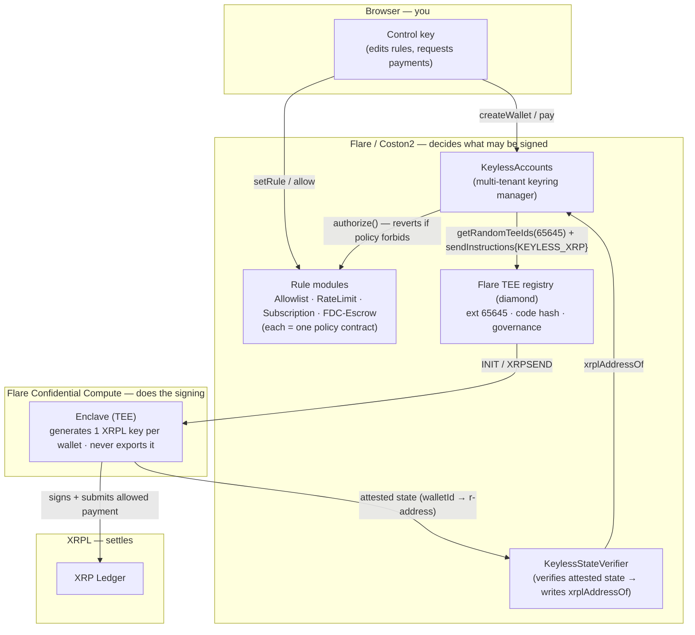

# Keyless

**An XRP account that only does what you allow — and can't be drained, even by whoever runs it.**

Keyless gives an XRP wallet a signing key that is **born inside a Flare Confidential Compute TEE and never leaves it**. The key will only ever sign a payment that an **on-chain policy on Flare** has already approved. Steal the browser control key, compromise the app, or own the machine the enclave runs on — none of it lets you move funds anywhere the rules forbid. There is no exportable key to take.

> The rules aren't for you. They're for whoever gets in.

---

## The problem

Holding XRP is all-or-nothing. Whoever has the private key can send **anything, anywhere** — so:

- **A stolen key = a drained account.** Phishing, malware, a leaked backup: one key compromise is total loss. There is no "this key may only pay my exchange" setting on a raw wallet.
- **Bots, agents, and services must hold live keys.** An automated trading bot, an AI agent, or a payments service needs to sign on its own — which means a hot key that, if it leaks, empties the account. That risk is why few people run them and why they stay small.
- **Custodians and teams face the same all-or-nothing choice.** Either one person holds the keys (single point of failure) or you bolt on multisig ops. Neither expresses a simple rule like "only pay approved addresses, max 10 XRP/day."
- **XRPL can't fix this itself.** The XRP Ledger has **no smart contracts** — there is nowhere *on XRP* to enforce spending policy. So historically the only options were "trust the key holder" or "trust the operator's server." A server can promise rules, but it can also be changed, and its operator still holds a key that can sign anything.

The missing primitive: a key that is **provably unextractable** and **provably obedient to a public rule**.

## The solution

Keyless puts the policy on **Flare** and binds an XRPL signing key to it inside a **Confidential Compute TEE**:

- The signing key is **generated inside the enclave and never leaves** — nobody, including us or the machine operator, has ever seen it.
- Every payment must first pass an **on-chain policy contract** on Flare before the enclave will sign it.
- Anyone can **verify the binding on-chain**: which contract commands the enclave, and which exact code hash the enclave runs.

The trust boundary moves from "trust the key holder / trust the operator" to **"read the contract and read the registered code hash."** XRPL still settles the payment; Flare decides whether it's allowed; the TEE holds a key that can't be stolen and won't disobey.

---

## How it works — the trust chain

Every link here is verifiable on-chain or in open source.

1. **The key is born in the enclave.** `createWallet` sends an `INIT` instruction that the enclave answers by **generating a fresh XRPL key from its own entropy**. No key is ever imported, and only the resulting *address* ever leaves. (Flare's reference `fce-sign` does the opposite — it imports an operator-supplied key. We deliberately have no such code path.)
2. **The code hash is pinned on-chain.** Our Flare Confidential Compute extension (**id 65645** on Coston2) registers the enclave image's code hash (`addTeeVersion`) and a **governance signer-set**. A machine can only join the extension by attesting to *that exact hash* under *that governance* — so "trust the operator" becomes "read the registered code hash."
3. **One contract is the only boss.** `KeylessAccounts` is the extension's sole `instructionsSender` (verify: `getTeeExtensionInstructionsSender(65645)`). The enclave acts on instructions from that contract and nothing else — not the operator, not us.
4. **A policy gates every signature.** `pay()` runs the wallet's rule *before* the instruction is ever sent to the enclave. If the rule reverts, the enclave never sees the payment. The key can only sign what already passed policy.

## Architecture



**Three Flare surfaces, one flow:** Coston2 (policy + the attested TEE registry) decides *what may be signed*, Flare Confidential Compute *does the signing* inside the enclave, and XRPL *settles* the payment. The FDC-escrow rule adds a fourth: a payout that only unlocks after Flare's **Data Connector** attests a real-world condition.

---

## Rule templates (the policies)

Each policy is one small Solidity contract; the enclave never changes.

| Rule | What it enforces | For |
| --- | --- | --- |
| **Allowlist** | Pay only pre-approved recipients | Exchange-only / cold-storage-like accounts |
| **RateLimit** | Allowlist **+** a max spend per time window | Trading bots, agents |
| **Subscription** | One merchant may pull ≤ X per period | Recurring payments / pull payments |
| **FDC-Escrow** | Pay only after Flare's Data Connector attests a condition | Conditional / escrow payouts |

Rules are **lockable**: `lockRule(walletId)` one-way freezes the rule pointer and its config, closing the drain vector even if the control key is later stolen.

---

## Live on Coston2

The full loop is live on the current Flare FCC governance baseline (tee-node v0.0.21 / tee-proxy v0.0.18).

| Component | Address / id |
| --- | --- |
| Flare TEE registry (diamond) | `0x1a9C4A0f9D76c0b1D91d22E24E573a9b377618aE` |
| FCC extension id | **65645** |
| KeylessAccounts | `0x57eb332D7000752ee82a35cc1A75941F0a619979` |
| AllowlistRule | `0x7aE1dC15Acd4766132ac11A67DfdCde03bd8DeC2` |
| RateLimitRule | `0xDED9303f6b72bd88c3F6a34414Ee2935422ab27d` |
| SubscriptionRule | `0xA828482FaB7C149Aa6d339B31016cF0D7165AeDC` |
| FdcEscrowRule | `0x6ef53Ce1FBDa8B13A2CCAE598a77A5bdC27402F7` |
| TEE machine (production, governance-attested) | `0xD47F3c4E26173df11667c5Ad3723e66Fa45dD646` |

**Proven end-to-end**, same wallet and key:
- `createWallet` → the enclave generated XRPL address `rnbfVioih6PjuQNfBGRcN44Tin31CebvRA` **inside the TEE**.
- Attached the exchange-only Allowlist policy.
- `pay` → a **non-allowed** recipient **reverted on-chain** (`"recipient not allowed"`) — it never reached the key.
- `pay` → the **allowed** recipient → the enclave signed and submitted **5 XRP**, settled on XRPL testnet: [`35049922…2A6ABC6A`](https://testnet.xrpl.org/transactions/35049922E5096A090212A0B1B1EAD566F362B7D9268341E30707B24C2A6ABC6A) · `tesSUCCESS`.

---

## Repository layout

```
keyless/
├── backend/                         Foundry project — the contracts (the policy engine)
│   ├── src/
│   │   ├── KeylessAccounts.sol         Multi-tenant keyring manager; sole instructionsSender
│   │   ├── KeylessStateVerifier.sol    Verifies attested TEE state → writes xrplAddressOf (in progress)
│   │   ├── rules/
│   │   │   ├── KeylessRuleBase.sol        Shared rule scaffolding (onlyAccounts, lockable)
│   │   │   ├── AllowlistRule.sol          Exchange-only: pay only allowlisted recipients
│   │   │   ├── RateLimitRule.sol          Allowlist + a per-window spend cap
│   │   │   ├── SubscriptionRule.sol       One merchant may pull ≤ X per period
│   │   │   └── FdcEscrowRule.sol          Pay only after Flare FDC attests a condition
│   │   └── interfaces/                  IKeylessRule, ITeeExtensionRegistry, ITeeMachineRegistry, IFdc
│   ├── test/                         Foundry tests incl. the stolen-control-key adversary case
│   └── script/                       Deploy + demo setup for Coston2
├── enclave/                         Flare Confidential Compute extension (forked from fce-sign)
│   ├── go/                             The TEE node — generates keys in-enclave, signs XRPL (CUSTOM)
│   ├── go/tools/                       Registration tooling (register-extension, set-governance, register-tee…)
│   ├── proxy/                          Self-contained tee-proxy build (v0.0.18)
│   └── config/, scripts/               Chain configs + the go-live scripts
├── frontend/                        Next.js 16 + React 19 + viem — the wallet UI (embedded control key)
└── *.md                             ARCHITECTURE, FCC_TRACK2, POSITIONING, DEPLOY_RUNBOOK (root-level)
```

Key architecture/strategy docs at the repo root: [`ARCHITECTURE.md`](ARCHITECTURE.md) (component + sequence diagrams + threat model), [`FCC_TRACK2.md`](FCC_TRACK2.md) (the Confidential Compute deep-dive), [`POSITIONING.md`](POSITIONING.md), [`STAKING_ROADMAP.md`](STAKING_ROADMAP.md), [`DEPLOY_RUNBOOK.md`](DEPLOY_RUNBOOK.md).

---

## Quickstart

```bash
# 1. Contracts
cd backend
forge install && forge build
forge test -vvv                         # includes the stolen-control-key adversary test

# 2. Run the enclave + register it (simulated TEE, Docker + ngrok)
cd ../enclave
bash ./scripts/use-chain.sh local coston2 go
ngrok http 6674                          # paste the URL into EXT_PROXY_URL
bash ./scripts/start-services.sh --chain coston2
bash ./scripts/post-build.sh             # allow-tee-version → set-governance → register-tee

# 3. Frontend
cd ../frontend && npm install && npm run dev
```

See [`DEPLOY_RUNBOOK.md`](DEPLOY_RUNBOOK.md) for the full go-live sequence and gotchas.

---

## The demo beat

1. Create an account — the enclave mints an XRP address; **nobody, anywhere, holds its key**.
2. Pick a rule (exchange-only, bot with a daily cap, subscription, conditional escrow).
3. Try to pay a random address → the contract **reverts on-chain**. Show the four lines that make theft impossible.
4. Pay the allowed address → **real XRP settles on XRPL**, signed by a key that lives only in the TEE.

Judges read Solidity and a registered code hash instead of trusting an operator.

---

## Two Flare tracks

- **Track 1 (XRP interop):** a real, useful XRP product — an undrainable, programmable XRP account — built natively on XRP where the TEE moat actually earns its keep (XRPL has no contracts).
- **Track 2 (Confidential Compute):** the confidential-compute engine that makes it possible, with the attestation **verified on-chain**, not asserted off-chain. See [`FCC_TRACK2.md`](FCC_TRACK2.md).

---

## Status & honesty

- **Runs in Flare's simulated TEE mode (MODE=1) today** — a fixed code hash, not hardware attestation. The architecture is attestation-ready; the mainnet path is real Flare TEE machines. We say this plainly rather than imply hardware guarantees we don't yet have.
- **`KeylessStateVerifier` is in progress.** The enclave emits signed, code-hash-bound state; the contract that verifies it on-chain and writes `xrplAddressOf` is the closing hop (see [`FCC_TRACK2.md`](FCC_TRACK2.md)).
- **Keyless is not "a smart account for XRP."** That's access/UX (and Flare Smart Accounts already do it). Keyless is about **safety**: a TEE-held key that even your own key can't drain.
- **Quantum:** Keyless enforces *policy*, not key secrecy against a quantum adversary — an attacker who could derive the key from the public key would sign on XRPL directly, bypassing Flare. Keyless is a policy-enforcement primitive, not post-quantum cryptography.

---

## Path to mainnet

**Today's testnet deployment runs one simulated enclave (`MODE=1`) with keys in RAM — a demo shortcut, not the production design.** Its honest limitation: if that single machine restarts, it regenerates its identity and loses its in-memory keys, so wallets created before the restart stop working (on testnet, recover routing with [`enclave/scripts/reregister-railway.sh`](enclave/scripts/reregister-railway.sh)). On mainnet that would be unacceptable for a wallet — and it is exactly what the production architecture removes:

1. **Threshold key backup (`walletkeymanager`).** The signing key is secret-shared — `sk = S_provider + S_admin` — across ⅔ of Flare's data providers **plus the wallet owner's own key admins**, and re-sharded periodically. If a TEE machine dies, the key is **restored onto another attested TEE** from those shares. **Machine death ≠ fund loss**, and no single party ever holds the key.
2. **Hardware attestation (`MODE=0`).** Real Confidential Space ties machine identity to attested hardware, so identity is stable across restarts — no orphaned registrations.
3. **A fleet of machines.** Production runs many attested TEEs per extension; one restarting doesn't take the service down.

So mainnet Keyless is as trustworthy as Flare's own security root: a key that **cannot be lost by any single party and cannot be extracted by any single party** — only reconstructed by a decentralized threshold, and only inside policy-enforcing code. That backup design is a first-class Flare mechanism (see [`FCC_TRACK2.md`](FCC_TRACK2.md)); wiring Keyless onto it is the primary post-hackathon milestone.
